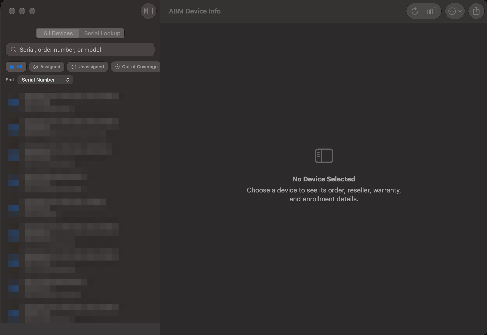
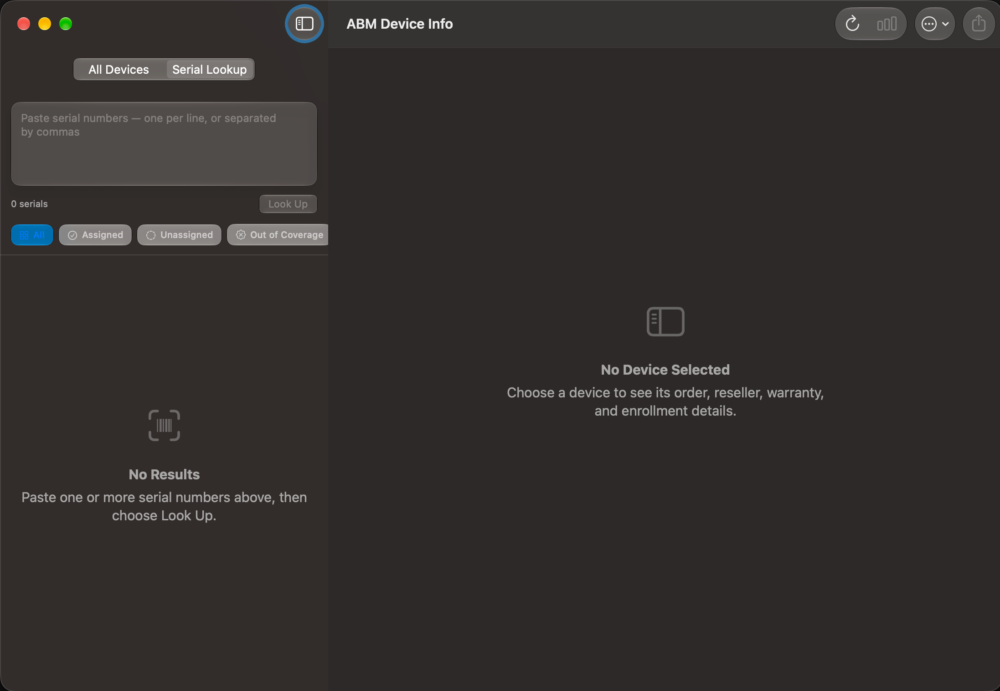

# ABM Device Info

A native macOS utility for **Apple Business Manager (ABM)** that makes device inventory, warranty, AppleCare, and MDM information easy to search and export.

Look up a single device, multiple serial numbers, or your entire organization. Filter devices, review detailed information, check coverage, and export inventory data to CSV.

---

## 📥 Download & Install

### Download

Download **`ABM Device Info.pkg`** directly from the main repository.

### Install

1. Download **`ABM Device Info.pkg`**.
2. Double-click the package.
3. Follow the installation prompts.
4. Launch **ABM Device Info** from **Applications** or **Spotlight**.

### If macOS Blocks the Installer

If macOS displays:

> "ABM Device Info.pkg can't be opened because it is from an unidentified developer."

You can:

**Option 1 — Open manually**

Control-click the `.pkg` → **Open** → **Open**

**Option 2 — Allow in System Settings**

Go to:

**System Settings → Privacy & Security → Open Anyway**

**Option 3 — Remove the quarantine attribute**

```bash
xattr -dr com.apple.quarantine ~/Downloads/"ABM Device Info.pkg"
```

> **Note:** Only bypass Gatekeeper for software you trust. The application uses an Apple Business Manager private key with access to your organization's device inventory.

---

## ✨ Features

* 🔎 **Device Lookup** — Search for one or multiple serial numbers
* 📋 **Complete Inventory** — View all devices in your Apple Business Manager organization
* 🛡️ **Warranty & AppleCare** — Check coverage status and expiration dates
* 🖥️ **MDM Information** — See the assigned device management service
* 📦 **Purchase Details** — View PO number, order date, reseller, and customer information
* 🎯 **Quick Filters** — Find assigned, unassigned, expired, or soon-to-expire devices
* 📊 **CSV Export** — Export filtered or complete inventory
* 🔐 **Secure Credentials** — Credentials are stored in the macOS Keychain
* 🍎 **Native macOS App** — Built specifically for macOS

---

## 📋 Requirements

* **macOS 14 or later**
* An **Apple Business Manager API account**
* API permissions to read device information

---

## 🔐 Apple Business Manager Setup

ABM Device Info does not include any Apple Business Manager credentials.

The application connects directly to **your Apple Business Manager organization** using an API account that you configure.

### 1. Create an API Account

In Apple Business Manager:

**Settings → API → Add API Account**

An **Organization Administrator** is required to create the API account.

You will need:

* Client ID
* Key ID
* Private Key (`.pem`)

### 2. Assign the Required Role

Assign the API account the appropriate device-management role.

Recommended:

**Device Enrollment Manager**

For organizations migrated from legacy Apple Business Manager or Business Essentials, Apple may require:

**Device API Manager**

If the API returns `403` errors, verify the account's permissions under:

**Settings → Roles and Permissions**

### 3. Configure ABM Device Info

Open:

**ABM Device Info → Apple Business Manager Credentials…**

Shortcut:

```text
⌘,
```

Enter:

* Client ID
* Key ID
* Private Key

Credentials are stored securely in the **macOS login Keychain**.

### Private Key with a Passphrase

If your private key is passphrase-protected, convert it to an unencrypted PKCS#8 key:

```bash
openssl pkcs8 -topk8 -nocrypt \
  -in encrypted.pem \
  -out private-key.pem
```

Use the resulting `private-key.pem` when configuring the application.

---

# 🚀 Using ABM Device Info

## All Devices

The **All Devices** view loads your organization's Apple Business Manager inventory.



Search and filter devices using:

* Serial number
* Order number
* Model
* Part number
* Reseller number

### Quick Filters

| Filter                 | Description                             |
| ---------------------- | --------------------------------------- |
| **All**                | All devices                             |
| **Assigned**           | Devices assigned to an MDM service      |
| **Unassigned**         | Devices without an assigned MDM service |
| **Out of Coverage**    | Devices without active coverage         |
| **Expiring ≤ 90 Days** | Devices approaching coverage expiration |

You can also sort devices by:

* Model
* Serial number
* Order date
* Date added
* Coverage expiration

---

## Serial Lookup



Use **Serial Lookup** when you need to check specific devices.


Paste serial numbers separated by:

* Line breaks
* Commas
* Semicolons
* Spaces

Press:

```text
⌘ Return
```

The application automatically handles:

* Duplicate serial numbers
* Uppercase / lowercase differences
* Multiple serial numbers in a single lookup

Results are grouped into:

* **Found**
* **Not in this organization**
* **Failed**

Click the result notification to see which serial numbers belong to each group.

---

## Device Details

Select a device to view detailed information.

### Purchase Information

* Purchase Order
* Order Date
* Reseller Number
* Apple Customer Number

### Coverage

* Warranty status
* Warranty expiration
* AppleCare coverage
* AppleCare contract information

### MDM

* Assigned device management service
* Service type
* Assignment status

### Hardware

* Serial number
* Model
* Part number
* Hardware identity
* Network identifiers

Use **Copy All** or **Copy CSV** to copy the complete device record.

---

## 🛡️ Warranty & AppleCare

Coverage information is retrieved separately and uses one API request per device.

For individual devices, coverage information is loaded when you select the device.

To retrieve coverage for all currently listed devices, use:

**Devices → Fetch Coverage for All Listed**

Shortcut:

```text
⌘K
```

This is required when you want to use coverage-based filters or generate a complete coverage report.

---

## 📊 Export to CSV

Export the devices currently displayed using:

**File → Export Devices to CSV…**

Shortcut:

```text
⌘E
```

The export contains all available device fields and can optionally include warranty and AppleCare information.

The resulting CSV works with:

* Microsoft Excel
* Apple Numbers
* Google Sheets
* BI platforms
* Asset management workflows

The export contains **exactly the devices currently listed**, making it easy to export filtered inventory.

---

# 💡 Use Cases

### Help Desk

Check whether a device is still covered by warranty or AppleCare before processing a repair request.

### Warranty & AppleCare Renewals

Use **Expiring ≤ 90 Days** to identify devices approaching coverage expiration and export the results for renewal planning.

### Asset & Procurement Reconciliation

Compare Apple Business Manager inventory with procurement records using:

* Purchase Order number
* Order date
* Reseller number
* Apple customer number
* Serial number

### Enrollment Gaps

Use the **Unassigned** filter to identify devices that are present in Apple Business Manager but are not assigned to a device management service.

### Multi-MDM Environments

View the device's assigned device management service, service type, and status directly from the device details.

### Receiving & Onboarding

Paste serial numbers from a shipment and quickly verify that the devices have appeared in your Apple Business Manager organization.

### Inventory & Audits

Export the complete inventory or any filtered view to CSV for:

* Excel / Numbers
* Reporting
* BI tools
* Asset reconciliation
* Audit snapshots

---

# ⌨️ Keyboard Shortcuts

| Action                             | Shortcut  |
| ---------------------------------- | --------- |
| Apple Business Manager Credentials | `⌘,`      |
| Export Devices                     | `⌘E`      |
| Refresh All Devices                | `⌘R`      |
| Fetch Coverage for All Listed      | `⌘K`      |
| Reconnect / New Access Token       | `⌘⇧R`     |
| Serial Lookup                      | `⌘Return` |

---

# 🧭 Menu Reference

| Menu                | Action                              | Shortcut |
| ------------------- | ----------------------------------- | -------- |
| **ABM Device Info** | About                               |          |
|                     | Apple Business Manager Credentials… | `⌘,`     |
| **File**            | Export Devices to CSV…              | `⌘E`     |
| **Devices**         | Refresh All Devices                 | `⌘R`     |
|                     | Fetch Coverage for All Listed       | `⌘K`     |
|                     | Filter                              |          |
|                     | Sort By                             |          |
|                     | Reconnect (New Access Token)        | `⌘⇧R`    |
| **Help**            | Developed by Rohit Gupta            |          |

---

# 🛠️ Troubleshooting

### `403` — "The API key in use does not allow this request"

The API account likely does not have the required device permissions.

Check the API account's role in:

**Apple Business Manager → Settings → Roles and Permissions**

After changing the role, use:

**Devices → Reconnect**

or:

```text
⌘⇧R
```

> Apple Business Manager access tokens can remain valid for approximately one hour and retain the permissions granted when they were issued. Reconnecting generates a new token with the updated permissions.

---

### `invalid_client`

Verify that all three credentials belong to the **same API account**:

* Client ID
* Key ID
* Private Key

If any of these belong to a different API account, authentication will fail.

---

### Connected Successfully, but No Devices Are Displayed

Check whether the API account is restricted to specific organizational units or lacks access to the organization's device inventory.

Verify the API account's role and scope in Apple Business Manager.

---

# 🔒 Privacy & Security

ABM Device Info is designed to communicate directly with your Apple Business Manager organization.

* 🔐 Credentials are stored in the **macOS login Keychain**
* 🚫 Credentials are not stored in application preferences or files
* 🍎 API communication is limited to Apple services
* 🚫 No analytics
* 🚫 No telemetry
* 🚫 No third-party tracking
* 🚫 No third-party service dependencies
* 💾 Device information is not written to disk unless you explicitly export it

Your Apple Business Manager credentials and device inventory remain under your control.

---

## 👨‍💻 Author

**Rohit Gupta**

Staff IT System Engineer
Apple Platform • MDM • IAM • Automation

---
